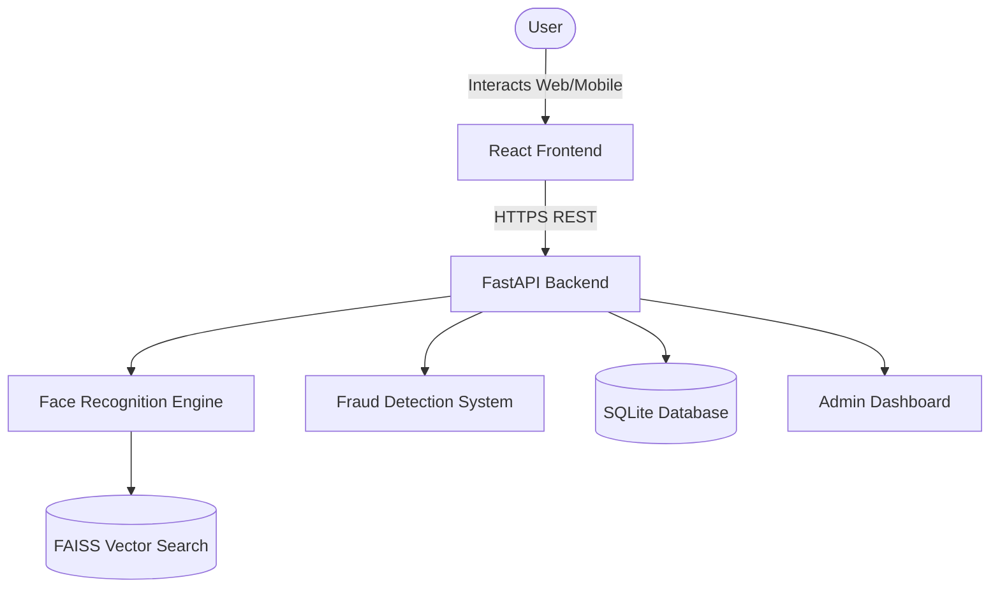
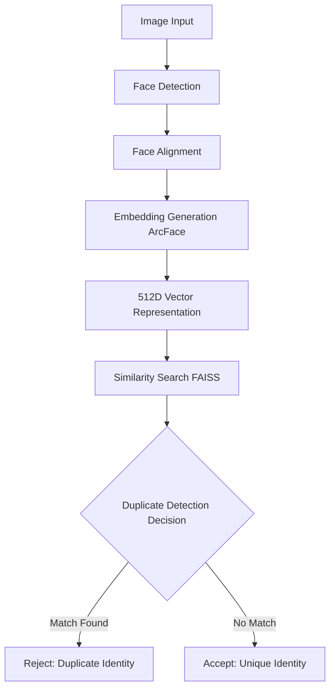
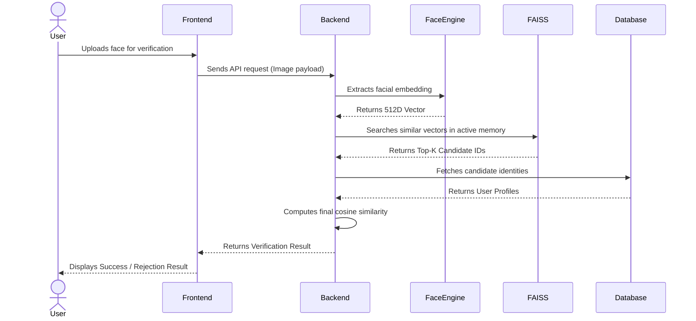

# IdentityGuard AI - Face-Based User De-Duplication System

## 1. Repository Overview

This repository contains the **IdentityGuard AI** project. 

The main system and all of its core application components are located inside the folder:

```
identityguard-ai/
```

This system implements robust biometric identity verification using advanced facial recognition technology to ensure secure and unique user registrations.

---

## 2. What the System Does

The core purpose of IdentityGuard AI is to guarantee that **a single real human can only create one digital identity**. 

To achieve this, the system provides several key capabilities:
- **Duplicate Identity Prevention**: Ensures that an individual cannot register multiple accounts under different names.
- **Biometric Authentication**: Allows users to securely verify their identity using only their face.
- **Fraud Detection**: Utilizes liveness heuristics to prevent spoofing via printed photos or digital screens.
- **AI-Based Face Comparison**: Extracts and compares high-dimensional facial embeddings for extreme accuracy.

---

## 3. Repository Structure

The repository is organized to completely isolate the production-ready application from legacy prototypes and standard Git elements.

```
face_de_duplication copy 2
│
├── identityguard-ai
│   ├── backend               # FastAPI backend, AI engine, and API routes
│   ├── frontend              # React/Vite UI and frontend assets
│   ├── data                  # SQLite databases and dataset storage
│   ├── models                # ONNX models and DL checkpoints
│   ├── docs                  # Detailed architectural and implementation documentation
│   ├── monitoring            # Grafana dashboards and system monitoring configs
│   ├── legacy                # Historical and experimental prototype code
│   ├── docker-compose.yml    # Docker orchestration configuration
│   ├── nginx.conf            # NGINX reverse proxy configuration
│   └── README.md             # Primary application-level README
│
├── .gitignore                # Root gitignore to protect against development artifacts
└── README.md                 # This repository overview file (You are here)
```

---

## 4. System Architecture Diagram



---

## 5. AI Face Recognition Pipeline



---

## 6. Identity Verification Sequence Diagram



---

## 7. Technology Stack

**Frontend:**
- React
- Vite
- Bootstrap 5

**Backend:**
- FastAPI
- Python 3

**AI & Computer Vision:**
- DeepFace
- ArcFace
- OpenCV
- NumPy
- Scikit-learn

**Infrastructure & Search:**
- Docker
- NGINX
- FAISS (Facebook AI Similarity Search)
- Grafana (Monitoring)

**Testing:**
- PyTest
- Playwright

---

## 8. Running the System

You can run the different components manually or orchestrate them via Docker.

### Backend

Navigate to the `identityguard-ai/backend` directory and start the FastAPI server:

```bash
cd identityguard-ai/backend
uvicorn app.main:app --reload
```

### Frontend

Navigate to the `identityguard-ai/frontend` directory, install dependencies, and start the development server:

```bash
cd identityguard-ai/frontend
npm install
npm run dev
```

### Docker

Alternatively, launch the entire stack (Backend, Frontend, Database, FAISS, NGINX) using Docker Compose from the application root:

```bash
cd identityguard-ai
docker compose up
```

---

## 9. Demo Workflow

To observe the system in action:

1. **Register a New Identity:** Navigate to the Web UI and register a new identity using a clear face image.
2. **Attempt Fraud:** Attempt to register the exact same face again under a different name or email.
3. **Detection:** The system will successfully detect the duplicate identity based purely on the facial embedding and block the registration.
4. **Log the Event:** The fraud monitor logs the suspicious event in the backend.
5. **Admin Review:** Log into the Admin Dashboard to visualize the blocked registration, investigate suspicious activity, and monitor overall system health.

---

## 10. Documentation

Deeper, highly detailed technical documentation exists inside the application's dedicated `docs/` folder:

```
identityguard-ai/docs/
```

Key documents include:
- `architecture.md`: In-depth breakdown of the system components.
- `implementation_plan.md`: Details steps taken to reorganize and finalize the repo.
- `production_validation_report.md`: Verification results and testing history.

---

## 11. License & Notes

This project is intended strictly for research, portfolio demonstration, and educational purposes. It is heavily documented and continuously validated to serve as an example of production-ready machine learning infrastructure and systems architectural design.
